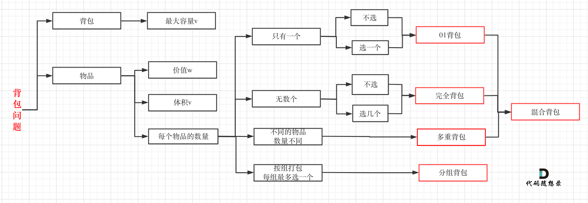
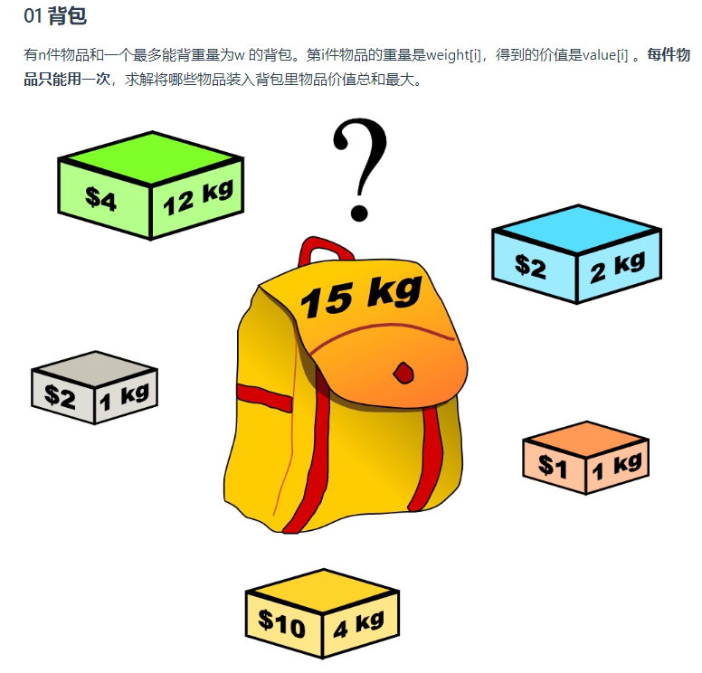

1. 0-1背包：

    1. 二维数组实现：遍历顺序从前往后，先遍历物品/背包容量无所谓；dp[i][j]=Math.max(dp[i-1][j], dp[i-1][j-weight[1]+values[i])

    2. 滚动数组实现：遍历顺序**从后往前**，一定要先遍历物品再遍历背包容量。

    2.完全背包：

    1. 二维数组实现：遍历顺序从前往后，先遍历物品/背包容量无所谓；dp[i][j]=Math.max(dp[i-1][j],**dp[i]**[j-weight[i]+values[i])

    2. 滚动数组实现：遍历顺序**一定要从前往后**，先遍历物品/背包容量无所谓；

    3.先遍历物品再遍历背包容量 是求组合数;先遍历背包容量，再遍历物品是求排列数。

### 暴力解法：

每一件物品其实只有两个状态，取或者不取，所以可以使用回溯法搜索出所有的情况，那么时间复杂度就是$o(2^n)$，这里的n表示物品数量。

### 确定遍历顺序

先遍历背包容量，或者先遍历物品都可以，因为dp[i][j]所需要的上个状态都在左上角，**不影响dp[i][j]公式的推导！**

但推荐先遍历物品再遍历背包，也就是每一层都从左到右

### 滚动数组优化：

在使用二维数组的时候，递推公式：dp[i][j] = max(dp[i - 1][j], dp[i - 1][j - weight[i]] + value[i]);

**其实可以发现如果把dp[i - 1]那一层拷贝到dp[i]上，表达式完全可以是：dp[i][j] = max(dp[i][j], dp[i][j - weight[i]] + value[i]);**

 **与其把dp[i - 1]这一层拷贝到dp[i]上，不如只用一个一维数组了** ，只用dp[j]（一维数组，也可以理解是一个滚动数组）。

这就是滚动数组的由来，需要满足的条件是上一层可以重复利用，直接拷贝到当前层。

读到这里估计大家都忘了 dp[i][j]里的i和j表达的是什么了，i是物品，j是背包容量。

 **dp[i][j] 表示从下标为[0-i]的物品里任意取，放进容量为j的背包，价值总和最大是多少** 。

一定要时刻记住这里i和j的含义，要不然很容易看懵了。

动规五部曲分析如下：

1. 确定dp数组的定义

在一维dp数组中，dp[j]表示：容量为j的背包，所背的物品价值可以最大为dp[j]。

2. 一维dp数组的递推公式

dp[j]为 容量为j的背包所背的最大价值，那么如何推导dp[j]呢？

dp[j]可以通过dp[j - weight[i]]推导出来，dp[j - weight[i]]表示容量为j - weight[i]的背包所背的最大价值。

dp[j - weight[i]] + value[i] 表示 容量为 j - 物品i重量 的背包 加上 物品i的价值。（也就是容量为j的背包，放入物品i了之后的价值即：dp[j]）

此时dp[j]有两个选择，一个是取自己dp[j] 相当于 二维dp数组中的dp[i-1][j]，即不放物品i，一个是取dp[j - weight[i]] + value[i]，即放物品i，指定是取最大的，毕竟是求最大价值，

所以递归公式为：

```text
dp[j] = max(dp[j], dp[j - weight[i]] + value[i]);
```

可以看出相对于二维dp数组的写法，就是把dp[i][j]中i的维度去掉了。

3. 一维dp数组如何初始化

 **关于初始化，一定要和dp数组的定义吻合，否则到递推公式的时候就会越来越乱** 。

dp[j]表示：容量为j的背包，所背的物品价值可以最大为dp[j]，那么dp[0]就应该是0，因为背包容量为0所背的物品的最大价值就是0。

那么dp数组除了下标0的位置，初始为0，其他下标应该初始化多少呢？

看一下递归公式：dp[j] = max(dp[j], dp[j - weight[i]] + value[i]);

dp数组在推导的时候一定是取价值最大的数，如果题目给的价值都是正整数那么非0下标都初始化为0就可以了。

 **这样才能让dp数组在递归公式的过程中取的最大的价值，而不是被初始值覆盖了** 。

那么我假设物品价值都是大于0的，所以dp数组初始化的时候，都初始为0就可以了。

4. 一维dp数组遍历顺序

代码如下：

```text
for(int i = 0; i < weight.size(); i++) { // 遍历物品
    for(int j = bagWeight; j >= weight[i]; j--) { // 遍历背包容量
        dp[j] = max(dp[j], dp[j - weight[i]] + value[i]);

    }
}
```

**这里大家发现和二维dp的写法中，遍历背包的顺序是不一样的！**

二维dp遍历的时候，背包容量是从小到大，而一维dp遍历的时候，背包是从大到小。

为什么呢？

 **倒序遍历是为了保证物品i只被放入一次！** 。但如果一旦正序遍历了，那么物品0就会被重复加入多次！

举一个例子：物品0的重量weight[0] = 1，价值value[0] = 15

如果正序遍历

dp[1] = dp[1 - weight[0]] + value[0] = 15

dp[2] = dp[2 - weight[0]] + value[0] = 30

此时dp[2]就已经是30了，意味着物品0，被放入了两次，所以不能正序遍历。

为什么倒序遍历，就可以保证物品只放入一次呢？

倒序就是先算dp[2]

dp[2] = dp[2 - weight[0]] + value[0] = 15 （dp数组已经都初始化为0）

dp[1] = dp[1 - weight[0]] + value[0] = 15

所以从后往前循环，每次取得状态不会和之前取得状态重合，这样每种物品就只取一次了。

**那么问题又来了，为什么二维dp数组遍历的时候不用倒序呢？**

因为对于二维dp，dp[i][j]都是通过上一层即dp[i - 1][j]计算而来，本层的dp[i][j]并不会被覆盖！

（如何这里读不懂，大家就要动手试一试了，空想还是不靠谱的，实践出真知！）

**再来看看两个嵌套for循环的顺序，代码中是先遍历物品嵌套遍历背包容量，那可不可以先遍历背包容量嵌套遍历物品呢？**

不可以！

因为一维dp的写法，背包容量一定是要倒序遍历（原因上面已经讲了），如果遍历背包容量放在上一层，那么每个dp[j]就只会放入一个物品，即：背包里只放入了一个物品。

倒序遍历的原因是，本质上还是一个对二维数组的遍历，并且右下角的值依赖上一层左上角的值，因此需要保证左边的值仍然是上一层的，从右向左覆盖。

（这里如果读不懂，就再回想一下dp[j]的定义，或者就把两个for循环顺序颠倒一下试试！）

 **所以一维dp数组的背包在遍历顺序上和二维其实是有很大差异的！** ，这一点大家一定要注意。


### 完全背包问题


我们知道01背包内嵌的循环是从大到小遍历，为了保证每个物品仅被添加一次。

而完全背包的物品是可以添加多次的，所以要从小到大去遍历，即：

```cpp
// 先遍历物品，再遍历背包
for(int i = 0; i < weight.size(); i++) { // 遍历物品
    for(int j = weight[i]; j <= bagWeight ; j++) { // 遍历背包容量
        dp[j] = max(dp[j], dp[j - weight[i]] + value[i]);

    }
}
```


01背包中二维dp数组的两个for遍历的先后循序是可以颠倒了，一维dp数组的两个for循环先后循序一定是先遍历物品，再遍历背包容量。

**在完全背包中，对于一维dp数组来说，其实两个for循环嵌套顺序是无所谓的！**

因为dp[j] 是根据 下标j之前所对应的dp[j]计算出来的。 只要保证下标j之前的dp[j]都是经过计算的就可以了。


### 组合和排列

如果先遍历物品，[1,2]和[2,1]代表了同一种方案，说明是组合，
