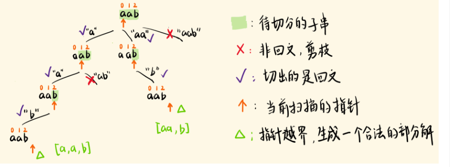

### 回溯法的效率

回溯法的性能如何呢，这里要和大家说清楚了， **虽然回溯法很难，很不好理解，但是回溯法并不是什么高效的算法** 。

 **因为回溯的本质是穷举，穷举所有可能，然后选出我们想要的答案** ，如果想让回溯法高效一些，可以加一些**剪枝**的操作，但也改不了回溯法就是穷举的本质。

那么既然回溯法并不高效为什么还要用它呢？

因为没得选，一些问题能暴力搜出来就不错了，撑死了再剪枝一下，还没有更高效的解法。

### 回溯法解决的问题

回溯法，一般可以解决如下几种问题：

* 组合问题：N个数里面按一定规则找出k个数的集合
* 切割问题：一个字符串按一定规则有几种切割方式
* 子集问题：一个N个数的集合里有多少符合条件的子集
* 排列问题：N个数按一定规则全排列，有几种排列方式
* 棋盘问题：N皇后，解数独等等

**相信大家看着这些之后会发现，每个问题，都不简单！**

另外，会有一些同学可能分不清什么是组合，什么是排列？

 **组合是不强调元素顺序的，排列是强调元素顺序** 。

例如：{1, 2} 和 {2, 1} 在组合上，就是一个集合，因为不强调顺序，而要是排列的话，{1, 2} 和 {2, 1} 就是两个集合了。

记住组合无序，排列有序，就可以了

### 如何理解回溯法

 **回溯法解决的问题都可以抽象为树形结构** ，是的，我指的是所有回溯法的问题都可以抽象为树形结构！

因为回溯法解决的都是在集合中递归查找子集， **集合的大小就构成了树的宽度，递归的深度，都构成的树的深度** 。

递归就要有终止条件，所以必然是一棵高度有限的树（N叉树）。

这块可能初学者还不太理解，后面的回溯算法解决的所有题目中，我都会强调这一点并画图举相应的例子，现在有一个印象就行。

### 回溯法模板

这里给出Carl总结的回溯算法模板。

在讲[二叉树的递归 **(opens new window)**](https://programmercarl.com/%E4%BA%8C%E5%8F%89%E6%A0%91%E7%9A%84%E9%80%92%E5%BD%92%E9%81%8D%E5%8E%86.html)中我们说了递归三部曲，这里我再给大家列出回溯三部曲。

* 回溯函数模板返回值以及参数

在回溯算法中，我的习惯是函数起名字为backtracking，这个起名大家随意。

回溯算法中函数返回值一般为void。

再来看一下参数，因为回溯算法需要的参数可不像二叉树递归的时候那么容易一次性确定下来，所以一般是先写逻辑，然后需要什么参数，就填什么参数。

但后面的回溯题目的讲解中，为了方便大家理解，我在一开始就帮大家把参数确定下来。

回溯函数伪代码如下：

```text
void backtracking(参数)
```

* 回溯函数终止条件

既然是树形结构，那么我们在讲解[二叉树的递归 **(opens new window)**](https://programmercarl.com/%E4%BA%8C%E5%8F%89%E6%A0%91%E7%9A%84%E9%80%92%E5%BD%92%E9%81%8D%E5%8E%86.html)的时候，就知道遍历树形结构一定要有终止条件。

所以回溯也有要终止条件。

什么时候达到了终止条件，树中就可以看出，一般来说搜到叶子节点了，也就找到了满足条件的一条答案，把这个答案存放起来，并结束本层递归。

所以回溯函数终止条件伪代码如下：

```text
if (终止条件) {
    存放结果;
    return;
}
```

* 回溯搜索的遍历过程

在上面我们提到了，回溯法一般是在集合中递归搜索，集合的大小构成了树的宽度，递归的深度构成的树的深度。

**横的叫树层，竖的叫树枝**

如图

注意图中，我特意举例集合大小和孩子的数量是相等的！

回溯函数遍历过程伪代码如下：

```text
for (选择：本层集合中元素（树中节点孩子的数量就是集合的大小）) {
    处理节点;
    backtracking(路径，选择列表); // 递归
    回溯，撤销处理结果
}
```

for循环就是遍历集合区间，可以理解一个节点有多少个孩子，这个for循环就执行多少次。

backtracking这里自己调用自己，实现递归。

#### 什么时候用 `backTracking(i+1)` ，什么时候用 `backTracking(i)`

- 如果一个数字只能取$1$次，为了避免下轮递归取到重复的数字,得使用前者。
- 如果一个数字可以取无数次，这里就得用 `backTracking(i)`了。

大家可以从图中看出 **for循环可以理解是横向遍历，backtracking（递归）就是纵向遍历** ，这样就把这棵树全遍历完了，一般来说，搜索叶子节点就是找的其中一个结果了。

分析完过程，回溯算法模板框架如下：

```text

void backtracking(参数) {
    if (终止条件) {
        存放结果;
        return;
    }

    for (选择：本层集合中元素（树中节点孩子的数量就是集合的大小）) {
        处理节点;
        backtracking(路径，选择列表); // 递归
        回溯，撤销处理结果
    }
}

```

#### 什么时候使用 used 数组，什么时候使用 begin 变量

有些朋友可能会疑惑什么时候使用 used 数组，什么时候使用 begin 变量。这里为大家简单总结一下：

- 排列问题，讲究顺序（即 [2, 2, 3] 与 [2, 3, 2] 视为不同列表时），需要记录哪些数字已经使用过，此时用 used 数组；
- 组合问题，不讲究顺序（即 [2, 2, 3] 与 [2, 3, 2] 视为相同列表时），需要按照某种顺序搜索，此时使用 begin 变量。

#### 分割回文串引发的思考——如果每层不再只选择一个数字加入path呢？

* 这一题每层的选择不再是只选择一个数字，而是可以选择$start$\~$n(n<s.length)$个数字，
* 所以$path.push()$那需要些变化————每次判断从$start$\~$i$是否为回文字符串，如果是才加入，
* 如 `“aabaa”`第一层就有 `“a”,"aa","aabaa"`三种选择，
* 然后每种选择再进去递归函数里面进行深层递归找到更多方案



### 出现的问题类型汇总：

#### 组合问题

1. 在数组里面取数字形成符合要求的组合，首先看一个元素允不允许重复取用，如果允许，递归时i不动。如果不允许，递归时i+1。
2. 接着看数组里有没有重复的数字，如果有，在树的同层时为了避免重复组合，要跳过重复的数字。`(i>start && nums[i] === nums[i - 1])`
3. 求组合问题，i从startIndex取；排列问题，i从0取。

#### 分割问题

1. 用start到i来控制分割的内容，如果要分割的内容合法，就加进Path中。记得回溯的时候要复原path。
2. 分割时需要的剪枝操作更多，要多观察画图找出适用于剪枝的情况。

#### 子集问题

1. 如果把 子集问题、组合问题、分割问题都抽象为一棵树的话，**那么组合问题和分割问题都是收集树的叶子节点，而子集问题是找树的所有节点！**
2. **子集问题，剪枝也很重要。**
3. **去重的方式：**
   1. **像我一样，用 `i > start && nums[i] === nums[i - 1]`直接做剪枝。**
   2. **每层横向遍历都维护一个 `set`，用 `set`过滤掉重复的元素。**
   3. **全局维护一个 `used`数组，跟着 `path`一起改变和回溯，这种做法主要用于排列问题中，因为排列常常需要 `i`从 `0`开始而不是从 `start`开始。**

#### 排列问题
